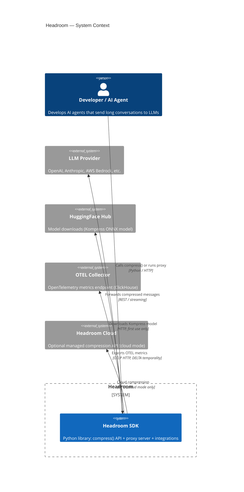

# Headroom System Context (C4 Level 0)

## Diagram

## Elements

| ID | Name | Type | Description |
|----|------|------|-------------|
| developer | Developer / AI Agent | Person | Uses Headroom to compress LLM conversations before sending to providers |
| sdk | Headroom SDK | System | Core Python library with `compress()` API, proxy server, and integrations |
| llm_provider | LLM Provider | System_Ext | Upstream LLM APIs (OpenAI, Anthropic, Bedrock, etc.) |
| huggingface | HuggingFace Hub | System_Ext | Downloads Kompress ONNX model (chopratejas/kompress-v2-base) |
| otel | OTEL Collector | System_Ext | OpenTelemetry metrics receiver (ClickHouse via otel-collector) |
| headroom_cloud | Headroom Cloud | System_Ext | Optional managed compression API for cloud mode |

## Notes

- Headroom is primarily a **Python SDK** that can be used as a library (`compress()`) or as a proxy server
- Cloud mode is optional — local compression is the primary mode
- HuggingFace is only contacted once (first Kompress model download, ~261MB ONNX)
- OTEL metrics use DELTA temporality — ClickHouse converts to cumulative (see ADR-0002)
