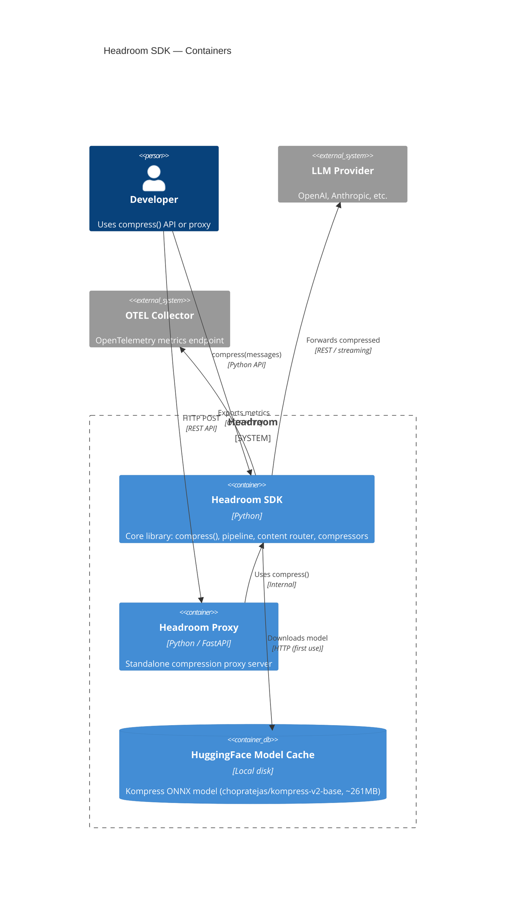

# Headroom SDK — Containers (C4 Level 1)

## Diagram

## Elements

| ID | Name | Type | Technology | Description |
|----|------|------|------------|-------------|
| sdk | Headroom SDK | Container | Python | Core library: `compress()`, pipeline, content router, per-type compressors |
| proxy | Headroom Proxy | Container | Python / FastAPI | Standalone HTTP compression proxy for integration without code changes |
| hf_cache | HuggingFace Model Cache | ContainerDb | Local disk | Kompress ONNX model cached after first download (~261MB INT8) |

## Notes

- **SDK is the primary artifact** — proxy is a convenience wrapper around the SDK
- **SDK has no hard dependency on LLM providers** — it compresses messages; the caller sends to any provider
- **HuggingFace model** is lazily loaded on first use, cached locally (no repeated downloads)
- **OTEL metrics** are optional — configured via `HEADROOM_OTEL_METRICS_ENABLED=true`
